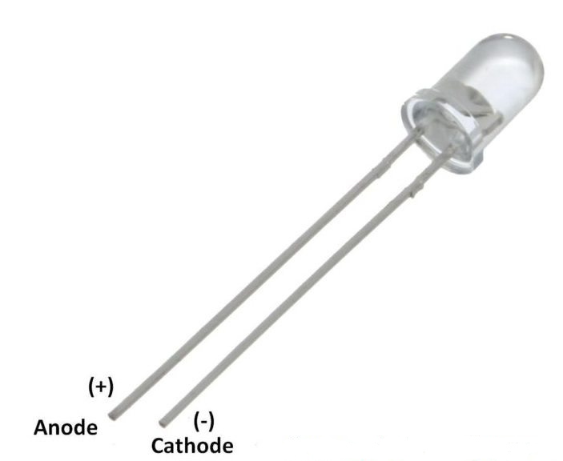

# Esp32 IR receiver + transmitter

<table style="margin-left:auto;margin-right:auto;">
  <tr style="margin-left:auto;margin-right:auto;">
    <td></td>
    <td></td>
  </tr>
 </table>
 <table style="margin-left:auto;margin-right:auto;">
  <tr style="margin-left:auto;margin-right:auto;">
    <td></td>
  </tr>
 </table>
 <table style="margin-left:auto;margin-right:auto;">
  <tr style="margin-left:auto;margin-right:auto;">
    <td></td>
  </tr>
 </table>
